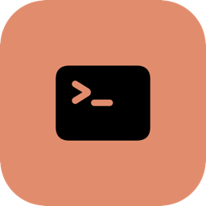

<div align="center">
  
  <h1>CacheTracker</h1>
</div>

Claude Code's prompt cache has a 1-hour TTL. There's no API to check if a
session's cache is still warm; the only real signal is time since last
activity. Lose track of that and you eat an expensive silent re-ingestion
next time you touch a stale session. CacheTracker watches your active
sessions' last-activity time and warns you before that happens.

It lives in the menu bar, not pinned to a specific spot on the built-in
display, because most of the team works off external monitors.

- Badge = count of active sessions, colored by worst case: **blue** (fresh),
  **orange** (40–55 min idle), **red** (55+ min idle, not handed off).
- Notification when a session first crosses into orange, and again when it
  crosses into red.
- Click the badge for a session list; check one off to mark it done/handed
  off (auto-reopens if that session sees new activity).

## Install

Requires `jq`.

```
./scripts/install-hooks.sh   # merges hooks into ~/.claude/settings.json, doesn't clobber existing ones
./scripts/build-app.sh
open /Applications/CacheTracker.app
```

Grant notification permission when prompted. No Dock icon, menu bar only.
No launch-at-login yet, so relaunch after reboots.

## How it works

`hooks/cache-touch.sh` fires on every Claude Code tool call and on session
start, writing last-activity state to `~/.claude/cache-tracker/`. The app
polls that directory every 60s and computes status from elapsed time.
Marking a session done writes to a separate `handoffs.json` so it's never
clobbered by the hook. Sessions idle 24h+ drop out of the active list but
their state file is left on disk.

## Uninstall

Remove the `hooks/cache-touch.sh` entries from `~/.claude/settings.json`,
quit the app, delete `/Applications/CacheTracker.app`, optionally delete
`~/.claude/cache-tracker/`.
